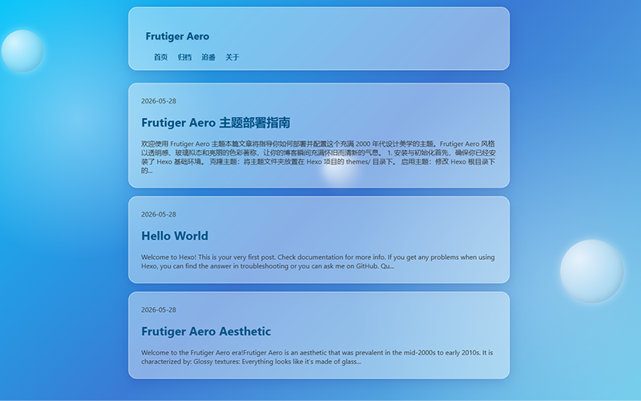

<div align="center">

# ✨ Hexo Theme Frutiger Aero

A nostalgic Hexo theme inspired by the Frutiger Aero aesthetic (mid-2000s to early 2010s)

English | [简体中文](./README.md)

</div>



## 🎨 Features

<table>
  <tr>
    <td width="50%">
      <h4>🪟 Glossy Glassmorphism</h4>
      <p>High-quality glass effects using <code>backdrop-filter</code></p>
    </td>
    <td width="50%">
      <h4>🌈 Vibrant Gradients</h4>
      <p>Bright blues and greens typical of the era</p>
    </td>
  </tr>
  <tr>
    <td width="50%">
      <h4>🫧 Animated Bubbles</h4>
      <p>Floating CSS bubbles for that extra nostalgic feel</p>
    </td>
    <td width="50%">
      <h4>📱 Responsive Design</h4>
      <p>Works on mobile, tablet, and desktop</p>
    </td>
  </tr>
  <tr>
    <td width="50%">
      <h4>⚡ Fast and Lightweight</h4>
      <p>No heavy dependencies, loads quickly</p>
    </td>
    <td width="50%">
      <h4>🎮 Special Features</h4>
      <p>Built-in Bangumi tracking, timeline archive, and about page</p>
    </td>
  </tr>
  <tr>
    <td width="50%">
      <h4>📐 Sidebar Layout</h4>
      <p>Right sidebar showing user avatar, bio, photo frame, and stats</p>
    </td>
    <td width="50%">
      <h4>🚀 Projects Page</h4>
      <p>Showcase your GitHub projects</p>
    </td>
  </tr>
  <tr>
    <td width="50%">
      <h4>📅 Custom Dates</h4>
      <p>Support custom publish dates for each post</p>
    </td>
    <td width="50%">
      <h4>💻 Code Highlighting</h4>
      <p>Beautiful code blocks with one-click copy</p>
    </td>
  </tr>
</table>

## 🚀 Quick Start

### 1. Installation

Go to your Hexo root directory and clone this repository:

```bash
git clone https://github.com/tud8951/hexo-theme-frutiger-aero themes/frutiger-aero
```

### 2. Configuration

Update your `_config.yml` in the Hexo root directory:

```yaml
theme: frutiger-aero
language: zh-CN
```

### 3. Start Preview

```bash
hexo server
```

## ⚙️ Configuration

### Full Configuration Example

Edit `themes/frutiger-aero/_config.yml` to customize:

```yaml
# Menu Configuration
menu:
  Home: /
  Archives: /archives
  Anime: /anime
  Projects: /projects
  About: /about

# Sidebar Configuration
sidebar:
  enabled: true
  username: Your Username
  avatar: /img/avatar.png
  description: Your Personal Bio
  photo_frame: /img/photo.jpg

# Social Links
social:
  github: your-github-username
  twitter: your-twitter-username (optional)

# Bangumi Configuration
bangumi:
  enabled: true
  user_id: your-bangumi-user-id

# Projects Configuration
# Method 1: Manual configuration (Recommended, no API dependency)
projects:
  - name: Project Name
    description: Project Description
    url: Project URL
    language: Programming Language
    stars: Star Count
    forks: Fork Count
    updated: Update Date

# Method 2: Fetch from GitHub API (may hit rate limits)
# github:
#   username: your-github-username
#   repos: []
```

### 📐 Sidebar Details

The sidebar includes:

| Feature | Description |
|---------|-------------|
| 👤 User Info | Avatar, username, personal bio |
| 🔗 Social Links | GitHub and Twitter links |
| 🖼️ Photo Frame | Display a photo |
| 📊 Site Stats | Post count, category count, tag count |
| 🏷️ Tag Cloud | Display all post tags |

### 📅 Custom Post Dates

You can set a custom publish date in the post front-matter:

```yaml
---
title: Post Title
date: 2024-01-01 00:00:00
published: 2025-11-02
tags: [tag1, tag2]
---
```

### 📁 Website Assets

Place your image resources in the `source/img/` directory:

- `favicon.png` - Website icon
- `avatar.png` - User avatar
- `photo.jpg` - Photo frame image

## 📄 Page Creation

### 🎮 Create Anime Page

Create `source/anime/index.md`:

```markdown
---
title: Anime
layout: anime
---
```

### 🚀 Create Projects Page

Create `source/projects/index.md`:

```markdown
---
title: Projects
layout: projects
---
```

## 🤝 Contributing

Issues and Pull Requests are welcome!

## 📄 License

MIT License © 2024
